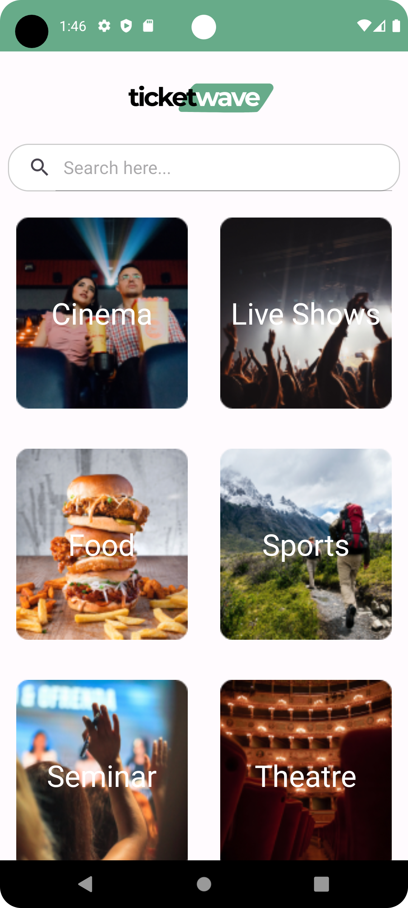
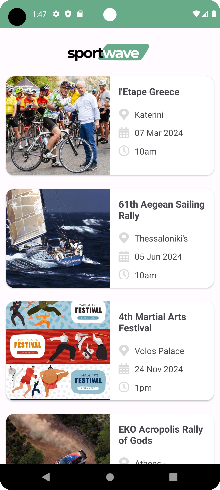

# Ticketwave (or Bookify) Frontend


Welcome to Ticketwave (or Bookify) - Your Ultimate Event Experience!

<h4>Visit the other repository, with the back-end of our application: <a href="https://github.com/evitadasy/Ticketwave-Backend"><b><i>Ticketwave-Backend</i></b><a/></h4>


## Table of Contents
- [Introduction](#introduction)
- [Contributors](#contributors)
- [Features](#features)
- [Screenshots](#screenshots)
- [Getting Started](#getting-started)
- [Installation](#installation)
- [Technologies Used](#technologies-used)

## Introduction 

Ticketwave (or Bookify) is an innovative event app that aims to revolutionize the way users discover, book, and experience events. With a user-friendly interface and powerful features, our app provides a seamless event management and attendance experience.This app was created as part of a seminar, skg.code 2023. 

## Contributors

* [Evita](https://github.com/evitadasy)
* [Zaxarias](https://github.com/zaxos95)
* [Kleanthis](https://github.com/Kleonhs)
* [Panagiots](https://github.com/pankar53)

## Features

- **Event Discovery:** Explore a wide range of events based on your preferences.
- **Booking:** Easily book tickets for your favorite events with just a few clicks.

## Getting Started

To get started with Ticketwave (or Bookify), follow these steps:

1. Clone this repository.
2. Install the necessary dependencies (see [Installation](#installation)).
3. Run the app locally or deploy it to a hosting service.

## Screenshots
<div float="left">
  
  
  
  
  
</div>

# Installation
<h4>For the correct use of the application, the following actions are required:</h4>

```
Check if the link of backend service, works (maybe it takes some time) https://bookify-zm4t.onrender.com.
If does not work, follow installation instructions on github repo of backend -> [https://github.com/evitadasy/Ticketwave-Backend](https://github.com/evitadasy/Ticketwave-Backend)

Then:
git clone https://github.com/uom-android-team2/WeBall_Statistics-Backend.git or download the zip from github and extract it
Open Android Studio and the app root folder.
Start any emulator (Pixel 7 API 30), and then you are ready to launch the app!
```

## Technologies Used
* 100% Kotlin
* Backend (Node.js, Express.js, MongoDB Atlas)
